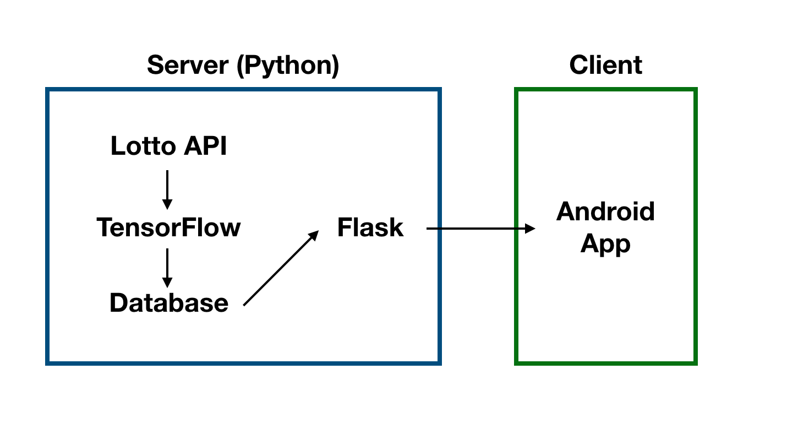

# LottoML

LottoML is a bot which is getting lotto's numbers calculated by machine learning. 

### Idea
The main idea is this, 'Are there any relation between date and lotto numbers?'
(It seems there is no relation)

### Details of Project
The server is running python Tensorflow and Flask. And Android App gets the result of machine
learning data. And shows on the view of App.

    

### Android App
https://play.google.com/store/apps/details?id=com.mllab.lottoml

    

